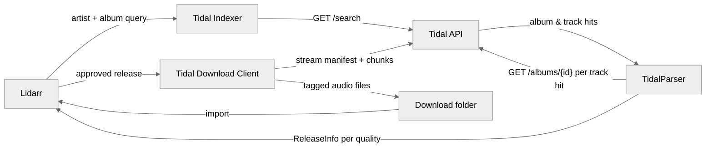

<h1 align="center">
  Tidal for Lidarr 🔌
</h1>
<p align="center">
  A <strong>Lidarr plugin</strong> that <em>turns a Tidal subscription into an automatically monitored music library</em>.
</p>

<br>

## What is Tidal for Lidarr?

Lidarr tracks the albums you care about and fetches them as they appear. Out of the box it only knows how to talk to torrent and Usenet indexers. This plugin registers Tidal as both an **indexer** and a **download client**, so Lidarr can search your Tidal subscription and pull lossless audio straight from it — monitoring, quality profiles, renaming, and import all behave exactly as they do for any other source.

This is a fork of [TrevTV/Lidarr.Plugin.Tidal](https://github.com/TrevTV/Lidarr.Plugin.Tidal) that adds a test suite and fixes three parser bugs and a request-amplification bug. See [What's different in this fork](#whats-different-in-this-fork-) below.

## Why use this? 🤔

A Tidal subscription already grants you the catalogue, but nothing connects it to a library you actually keep. The usual alternative is a browser tab, a third-party downloader, and manually dropping files where your music server can find them — repeated by hand every time an artist releases something.

With this plugin, adding an artist in Lidarr is the whole workflow. New releases are found, downloaded at the best quality your profile allows, tagged, and filed automatically.

## Features 🚀

- 🎧 **Lossless downloads:** pulls FLAC up to 24-bit Hi-Res where your subscription allows, falling back to AAC when it doesn't.
- 🔍 **Tidal as a Lidarr indexer:** album searches run against Tidal's catalogue and return releases Lidarr can grade against your quality profiles.
- 📥 **Automatic grabbing:** monitored albums download without intervention, through Lidarr's normal queue and import pipeline.
- 🎼 **Synced lyrics:** saves `.lrc` files when Tidal has them, with [LRCLIB](https://lrclib.net/) as a fallback provider.
- 🔁 **Format conversion:** optionally extracts FLAC from Tidal's M4A containers, or re-encodes AAC to MP3, via FFmpeg.
- 🔐 **PKCE login:** authenticates with your own Tidal account; credentials stay on disk in a directory you choose.
- 🐢 **Throttle-aware:** paces its own requests and backs off when Tidal rate-limits, instead of hammering the API.

## Architecture 🏗️



Note that every release Lidarr sees is an **album** — the parser resolves a matching track back to the album that contains it, because Lidarr has no concept of a standalone track.

## How to Install ⚡

### Prerequisites 📦

- A Lidarr instance on the `plugins` branch — the [`ghcr.io/hotio/lidarr:pr-plugins`](https://github.com/hotio/lidarr) image is the usual way to get one.
- An active [Tidal](https://tidal.com/) subscription (HiFi or above for lossless).
- Optionally [FFmpeg](https://ffmpeg.org/), only if you want the format-conversion settings.

### Running Lidarr 🐳

```yml
services:
  lidarr:
    image: ghcr.io/hotio/lidarr:pr-plugins
    container_name: lidarr
    environment:
      - PUID=1000
      - PGID=1000
      - TZ=Etc/UTC
    volumes:
      - /path/to/config/:/config
      - /path/to/downloads/:/downloads
      - /path/to/music:/music
    ports:
      - 8686:8686
    restart: unless-stopped
```

To make FFmpeg available to the conversion settings, build from this `Dockerfile` instead of using the image directly:

```Dockerfile
FROM ghcr.io/hotio/lidarr:pr-plugins

RUN apk add --no-cache ffmpeg
```

### Installing the plugin

1. In Lidarr, go to `System -> Plugins`, paste the repository URL into the GitHub URL box, and press **Install**. Restart Lidarr when it asks you to.

   ```
   https://github.com/jwmarb/Lidarr.Plugin.Tidal
   ```

2. Go to `Settings -> Indexers`, press **Add**, and choose **Tidal** (under *Other*, at the bottom).
3. Enter a path for user data, press **Test** — it will error — then press **Cancel**.
4. Refresh the page, re-open the Add screen, and choose **Tidal** again.
5. There is now a **Tidal URL** setting containing a login URL. Open it in a new tab.
6. Log in to Tidal and press **Yes, continue**. You land on a page reading "Oops." — copy that tab's URL, which looks like `https://tidal.com/android/login/auth?code=...`.
   - **Do not share this URL.** It grants access to your account.
   - Redirect URLs are single-use and expire within minutes. If login fails, fetch a fresh **Tidal URL** from the settings and try again.
7. Enter your user-data path again, paste the copied URL into **Redirect Url**, and press **Save**.
8. Go to `Settings -> Download Clients`, press **Add**, and choose **Tidal** (again under *Other*).
9. Set **Download Path** and adjust the remaining options to taste.
10. Go to `Settings -> Profiles`, find **Delay Profiles**, click the wrench on each one, and toggle **Tidal** on.

    Without this, every release is rejected with *"TidalDownloadProtocol is not enabled for this artist."*

11. Optional: in `Settings -> Media Management`, enable **Rename Tracks** so each album lands in its own folder rather than loose in the artist directory.
12. Optional: to keep `.lrc` lyrics, enable **Import Extra Files** in the same screen and add `lrc` to the list.

### Download client settings 🔧

| Setting | Default | Description |
| --- | --- | --- |
| `Download Path` | — | Where tracks are written before Lidarr imports them. |
| `Extract FLAC From M4A` | `false` | Extracts FLAC data from Tidal's M4A files. Needs FFmpeg. |
| `Re-encode AAC into MP3` | `false` | Re-encodes AAC to MP3. Needs FFmpeg. |
| `Save Synced Lyrics` | `false` | Writes a `.lrc` file when synced lyrics exist. |
| `Use LRCLIB as Backup Lyric Provider` | `false` | Falls back to LRCLIB when Tidal has no lyrics. |
| `Download Delay` | `false` | Adds a pause between track downloads to avoid rate limits. |
| `Download Delay Minimum` | `3` | Lower bound of that pause, in seconds. |
| `Download Delay Maximum` | `5` | Upper bound of that pause, in seconds. |

Only enable the FFmpeg-dependent settings if FFmpeg is genuinely available to Lidarr; otherwise downloads fail.

## What's different in this fork 🔧

| Fix | Effect |
| --- | --- |
| Per-response album de-duplication | An album reachable only through a track hit was re-fetched once per matching track, emitting N identical releases. Each album is now fetched and emitted once. |
| Removed a dead `Enum.Parse` | `audioQuality` is a free-form string upstream (`MQA` and `DOLBY_ATMOS` both occur). Parsing it threw and discarded every release in the response — and the parsed value was never used. |
| Null-guarded `mediaMetadata` | An album payload without `mediaMetadata` threw `NullReferenceException` and lost the whole page. |
| Backoff and a retry cap on HTTP 429 | The old handler retried with a flat delay, no backoff and no cap. Tidal's throttle is cumulative, so retrying renewed it and searches spun for minutes. |

Measured in a real Lidarr container, same search, before and after the throttle fix:

| Metric | Before | After |
| --- | --- | --- |
| Requests / distinct albums | 1471 / 25 (58.8x) | 41 / 41 (1.00x) |
| HTTP 429 responses | 109 of 132 | 0 of 44 |
| Album search wall time | ~7 min | 15 s |
| Interactive search | timed out (>300 s) | 6.6 s |

## Testing 🧪

The suite is 55 tests: offline unit tests over recorded API payloads, plus opt-in integration tests against the live Tidal API.

```sh
dotnet test src/Lidarr.Plugin.Tidal.Tests/Lidarr.Plugin.Tidal.Tests.csproj \
  -p:SolutionDir=$PWD/ext/Lidarr/src/ \
  -p:SkipILRepack=true \
  -p:NuGetAudit=false
```

Integration tests are skipped unless you opt in, and skip with a diagnostic — rather than failing — when credentials are missing or expired:

```sh
TIDAL_INTEGRATION=1 dotnet test ... --filter "Category=Integration"
```

Fixtures are real Tidal responses with every token, session ID, and user ID replaced by `REDACTED`; a test asserts this, so the scrubber is itself covered. See [`src/Lidarr.Plugin.Tidal.Tests/README.md`](src/Lidarr.Plugin.Tidal.Tests/README.md) for the three MSBuild properties above and why each is needed.

`Tools/TidalLogin` mints a fresh credential file when a token expires:

```sh
dotnet run --project src/Lidarr.Plugin.Tidal.Tests/Tools/TidalLogin \
  -p:SolutionDir=$PWD/ext/Lidarr/src/ -p:NuGetAudit=false -p:SkipILRepack=true
```

## Known Limitations ⚠️

- **Search results estimate file size.** Tidal's API does not report exact sizes, so releases carry a figure derived from duration and bitrate. Quality decisions that lean on size are approximate.
- **A track-name search returns its album.** Lidarr has no track entity and the download path requires an album URL, so a matching track resolves to the album containing it. If your metadata source lists a song as a standalone single but Tidal only ships it inside an album, Lidarr correctly rejects the album as *"Wrong album"* — search for the containing album instead.
- **Album searches make one request per unlisted track hit.** A broad query can still take tens of seconds, because every track whose album is absent from the album results needs its own lookup.
- **Access tokens live in their own directory,** chosen in the indexer settings, rather than in Lidarr's own credential storage.
- **Tidal throttles `/albums/{id}` cumulatively.** The plugin now backs off instead of provoking it, but an already-throttled account stays throttled for several minutes regardless.

## License 📜

Upstream [TrevTV/Lidarr.Plugin.Tidal](https://github.com/TrevTV/Lidarr.Plugin.Tidal) ships no license file, so no explicit grant covers this fork's own code. Treat it as all-rights-reserved unless upstream adds a license.

These libraries are merged into the final plugin assembly, which is what ILRepack produces to work around a bug in Lidarr's plugin loader. Their terms travel with the built DLL — note that **TidalSharp is GPL-3.0**, which governs redistribution of that artifact:

- [TidalSharp](https://github.com/TrevTV/TidalSharp) — GPL-3.0 ([LICENSE](https://github.com/TrevTV/TidalSharp/blob/main/LICENSE))
- [TagLibSharp](https://github.com/mono/taglib-sharp) — LGPL-2.1 ([COPYING](https://github.com/mono/taglib-sharp/blob/main/COPYING))
- [Newtonsoft.Json](https://github.com/JamesNK/Newtonsoft.Json) — MIT ([LICENSE](https://github.com/JamesNK/Newtonsoft.Json/blob/master/LICENSE.md))

---

Originally created by [TrevTV](https://github.com/TrevTV). Fork maintained with ❤️ by Joseph Marbella.
