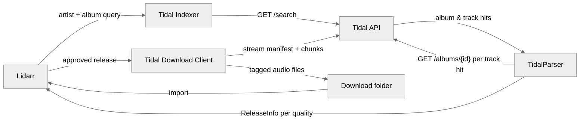

<h1 align="center">
  Tidal for Lidarr 🔌
</h1>
<p align="center">
  A <strong>Lidarr plugin</strong> that <em>turns a Tidal subscription into an automatically monitored music library</em>.
</p>

<br>

## What is Tidal for Lidarr?

Lidarr tracks the albums you care about and fetches them as they appear. Out of the box it only knows how to talk to torrent and Usenet indexers. This plugin registers Tidal as both an **indexer** and a **download client**, so Lidarr can search your Tidal subscription and pull lossless audio straight from it — monitoring, quality profiles, renaming, and import all behave exactly as they do for any other source.

This is a fork of [TrevTV/Lidarr.Plugin.Tidal](https://github.com/TrevTV/Lidarr.Plugin.Tidal) that adds a test suite and fixes three parser bugs and a request-amplification bug. See [What's different in this fork](#whats-different-in-this-fork-) below.

## Why use this? 🤔

A Tidal subscription already grants you the catalogue, but nothing connects it to a library you actually keep. The usual alternative is a browser tab, a third-party downloader, and manually dropping files where your music server can find them — repeated by hand every time an artist releases something.

With this plugin, adding an artist in Lidarr is the whole workflow. New releases are found, downloaded at the best quality your profile allows, tagged, and filed automatically.

## Features 🚀

- 🎧 **Lossless downloads:** pulls FLAC up to 24-bit Hi-Res where your subscription allows, falling back to AAC when it doesn't.
- 🔍 **Tidal as a Lidarr indexer:** album searches run against Tidal's catalogue and return releases Lidarr can grade against your quality profiles.
- 📥 **Automatic grabbing:** monitored albums download without intervention, through Lidarr's normal queue and import pipeline.
- 🎼 **Synced lyrics:** saves `.lrc` files when Tidal has them, with [LRCLIB](https://lrclib.net/) as a fallback provider.
- 🔁 **Format conversion:** optionally extracts FLAC from Tidal's M4A containers, or re-encodes AAC to MP3, via FFmpeg.
- 🔐 **PKCE login:** authenticates with your own Tidal account; credentials stay on disk in a directory you choose.
- 🐢 **Throttle-aware:** paces its own requests and backs off when Tidal rate-limits, instead of hammering the API.

## Architecture 🏗️



Note that every release Lidarr sees is an **album** — the parser resolves a matching track back to the album that contains it, because Lidarr has no concept of a standalone track.

## How to Install ⚡

> [!TIP]
> New to this plugin? **[docs/SETUP.md](docs/SETUP.md)** is a step-by-step setup guide that walks through the Tidal login handshake, where each field's value comes from, and the two Lidarr settings that otherwise silently block downloads.

### Prerequisites 📦

- A Lidarr instance on the [`plugins` branch](https://wiki.servarr.com/lidarr/installation), built from a **custom image** (see below). The stock [`ghcr.io/hotio/lidarr:pr-plugins`](https://github.com/hotio/lidarr) image does not ship FFmpeg.
- An active, paid [Tidal](https://tidal.com/) subscription. Since April 2024 Tidal's single paid plan includes lossless and Hi-Res FLAC (where a recording has a Hi-Res master), and the US free tier is gone. Plans differ by region.
- [FFmpeg](https://ffmpeg.org/) **inside the Lidarr container**, for the FLAC remux and the other conversion settings.
- A browser to complete Tidal's login. You never type your Tidal password into Lidarr; see [Logging in to Tidal](#logging-in-to-tidal-).

### Running Lidarr 🐳

> [!IMPORTANT]
> **A custom image is required.** The official plugins image contains no FFmpeg binary, and
> the plugin shells out to `ffmpeg`/`ffprobe` to remux downloads. Without it, Tidal's
> lossless tracks import with a bitrate of `-2147483648 kbps` and are misdetected as AAC —
> see [Why the remux matters](#why-the-remux-matters-) below. Build the image below rather
> than using `ghcr.io/hotio/lidarr:pr-plugins` directly.

Put this `Dockerfile` next to your compose file:

```Dockerfile
FROM ghcr.io/hotio/lidarr:pr-plugins

# The Tidal plugin shells out to these for the FLAC remux.
# Do not add a USER line: this image's s6 init must start as root.
RUN apk add --no-cache ffmpeg
```

Then point the service at it with `build:` instead of `image:`:

```yml
services:
  lidarr:
    build: .
    container_name: lidarr
    environment:
      - PUID=1000
      - PGID=1000
      - TZ=Etc/UTC
    volumes:
      - /path/to/config/:/config
      - /path/to/downloads/:/downloads
      - /path/to/music:/music
    ports:
      - 8686:8686
    restart: unless-stopped
```

Bring it up with `docker compose up -d --build`, and confirm FFmpeg is reachable:

```sh
docker compose exec lidarr ffmpeg -version
```

If that prints a version, the remux will work. On current builds, the download client's
**Test** button also fails with a clear message when the conversion settings are on but
FFmpeg is missing, so a broken setup is caught at save time rather than silently at download time.
Older builds have no such check; see [Which build you have](#which-build-you-have-).

### Installing the plugin 🔌

> [!WARNING]
> **The GitHub-URL install currently delivers an older build.** Lidarr only accepts a release asset named `…net8.0.zip`, and the newest releases are not named that way. See [Which build you have](#which-build-you-have-) to check, and to install the current build by hand.

1. In Lidarr, go to `System -> Plugins`, paste the repository URL into the GitHub URL box, and press **Install**. Restart Lidarr when it asks you to.

   ```
   https://github.com/jwmarb/Lidarr.Plugin.Tidal
   ```

2. Go to `Settings -> Indexers`, press **+**, and choose **Tidal** (in the *Other* section).
3. Enter an absolute **Config Path** such as `/config/tidal`, press **Test** (it will error), then press **Cancel**.
4. Refresh the page, re-open the Add screen, and choose **Tidal** again.
5. The **Tidal URL** field now holds a login link starting `https://login.tidal.com/authorize`. Open it in a new tab.
6. Log in to Tidal and press **Yes, continue**. You land on a page reading "Oops." That page means it worked. Copy that tab's whole URL, which starts `https://tidal.com/android/login/auth?code=`.
   - **Do not share this URL.** It grants access to your account.
   - Redirect URLs are single-use and expire within minutes. If login fails, start again from step 3 for a fresh **Tidal URL**.
7. Re-enter your **Config Path** if the form cleared it, paste the copied URL into **Redirect Url**, press **Test** (it should now pass), then **Save**.
8. Go to `Settings -> Download Clients`, press **+**, and choose **Tidal** (again under *Other*).
9. Set an absolute **Download Path**, turn on **Remux To FLAC**, and press **Test**. On current builds this checks that FFmpeg is present, but not that the folder is writable.
10. Go to `Settings -> Profiles`, find **Delay Profiles**, click the wrench on each one that existed before the install, and toggle **Tidal** on.

    Without this, every release is rejected with *"TidalDownloadProtocol is not enabled for this artist."*

11. Optional: in `Settings -> Media Management`, enable **Rename Tracks** so Lidarr applies your naming format on import. The default format files each album in its own folder.
12. Optional: to keep `.lrc` lyrics, press **Show Advanced** in the same screen, enable **Import Extra Files**, and add `lrc` to the list.

### Settings 🔧

**Indexer**

| Setting | Default | Description |
| --- | --- | --- |
| `Tidal URL` | — | Read-only. The PKCE login link to open in a browser. Blank until the indexer has run once. It is replaced each time the indexer runs without an error (a Test, a search), so don't press **Test** between opening the link and pasting the redirect back. |
| `Redirect Url` | — | The `tidal.com/android/login/auth?code=...` address of the "Oops." page you land on after approving the login. Single-use, and expires within minutes. |
| `Config Path` | — | Absolute directory where the plugin saves the login as `lastUser.json`, so a session survives a restart. Created if missing. Rejected on save if empty or relative. The first path the plugin sees stays in effect until Lidarr restarts. |
| `Early Download Limit` | none | Days before a release date that Lidarr may grab from this indexer. Advanced. |

**Download client**

| Setting | Default | Description |
| --- | --- | --- |
| `Download Path` | — | Where tracks are written before Lidarr imports them. Must be absolute. Neither **Save** nor **Test** checks that it exists or is writable. |
| `Remux To FLAC` | `false` | **Recommended.** Rewrites Tidal's fragmented M4A into a real FLAC container. Lossless. Needs FFmpeg. |
| `Re-encode AAC into MP3` | `false` | Re-encodes AAC to MP3. Needs FFmpeg. |
| `Save Synced Lyrics` | `false` | Writes a `.lrc` file when synced lyrics exist. Needs `lrc` in Import Extra Files. |
| `Use LRCLIB as Backup Lyric Provider` | `false` | Falls back to LRCLIB when Tidal has no lyrics. |
| `Download Delay` | `false` | Adds a pause between track downloads to avoid rate limits. |
| `Download Delay Minimum` | `3` | Lower bound of that pause, in seconds. |
| `Download Delay Maximum` | `5` | Upper bound of that pause, in seconds. |

If a conversion setting is enabled without FFmpeg present, the download client's **Test**
fails rather than letting every track quietly skip conversion. Should a remux fail at
download time anyway, the original file is kept and the track still imports.

### Which build you have 🏷️

The settings above describe the current build. The download client's second option tells you which build is installed:

| Option label | Build | Missing compared with the current build |
| --- | --- | --- |
| `Remux To FLAC` | `main`, or the `10.1.0.49-remux` release | Nothing user-facing. Only `main` reports owner `jwmarb`. |
| `Extract FLAC From M4A` | `10.1.0.48-throttlefix` or earlier, including the `10.1.0.47-e2e` build that the GitHub-URL install picks | The FFmpeg check in **Test** and the hardened remux. `10.1.0.47` also lacks the HTTP 429 backoff. |

Every published release, including the newest, reports its **owner** as `TrevTV`, so the owner column is not a reliable check. To run the current behaviour, download the `.zip` from the newest [release](https://github.com/jwmarb/Lidarr.Plugin.Tidal/releases), whatever it is named. Then copy its `.dll`, `.pdb`, and `.deps.json` into `<lidarr-config>/plugins/jwmarb/Lidarr.Plugin.Tidal/` and restart Lidarr. Because those builds report `TrevTV`, Lidarr checks upstream's repository for updates, so the update it offers is upstream's plugin; decline it.

### Why the remux matters 🎵

Tidal delivers lossless audio as DASH segments, which the plugin concatenates into a
**fragmented MP4**. The file plays fine, but its top-level `mvhd`/`mdhd` duration is `0`,
because fMP4 keeps timing in the per-fragment `moof` headers.

That zero cascades. TagLib reports duration 0 and bitrate 0, so Lidarr falls back to
estimating the bitrate as `(size * 8) / (duration * 1024)` — a division by zero, which
yields `Infinity` and casts to `int.MinValue`. Worse, with bitrate and bit depth both
reading 0, the quality parser mislabels lossless FLAC as lossy AAC, so quality profiles and
upgrade decisions act on the wrong information.

Enabling **Remux To FLAC** rebuilds the container with `-acodec copy` — no re-encode, not a
single sample altered. Measured on a real import of *The Life of a Showgirl*:

| Lidarr Audio Info | Without remux | With remux |
| --- | --- | --- |
| Quality | `AAC-VBR` | `FLAC` |
| Bitrate | `-2147483648 kbps` | `927 kbps` |
| Bit depth | *(absent)* | `16bit` |
| Codec | *(absent)* | `FLAC` |

## Logging in to Tidal 🔑

For a guided walkthrough of this and every other field, see **[docs/SETUP.md](docs/SETUP.md)**.

The plugin has no username or password field. Tidal's login is an OAuth **PKCE** handshake: the plugin creates a one-time login link, you approve it in a browser, and Tidal returns a short-lived code, which the plugin trades for tokens. Each indexer field holds one piece of that exchange:

| Field | Where its value comes from |
| --- | --- |
| `Config Path` | You choose it. Any absolute path inside the container that persists, e.g. `/config/tidal`. The tokens are saved there as `lastUser.json`. |
| `Tidal URL` | The plugin generates it. It appears after the indexer has run once, which is why the setup steps **Test**, cancel, and refresh before it shows. |
| `Redirect Url` | Tidal gives it to you. After you approve the login, the browser lands on an *"Oops."* page. That page's whole address, starting `https://tidal.com/android/login/auth?code=`, is the value. |

You only do this once. After the first successful **Test**, the plugin reloads `lastUser.json` on every start and refreshes the access token itself. You repeat the handshake only if that file is deleted, or Tidal revokes the session or stops accepting its refresh token.

Three things worth understanding, because each produces a confusing failure:

- **The code is bound to the link that produced it.** The login link carries a challenge derived from a secret the plugin holds only in memory, and the code can be redeemed only against that secret. A redirect from an older link, or from before a Lidarr restart, fails with `invalid_grant`, whatever its age.
- **The code expires within minutes.** Paste it and press **Test** promptly. A slow paste fails with `invalid_grant` … `The token has expired`.
- **Test does not say why the login failed.** Apart from an `Invalid Path` on the form, every failure shows the same *"Unable to connect to indexer, check the log for more details"*. The cause is the line under `Tidal login failed:` in **System → Logs**, and [the setup guide's table](docs/SETUP.md#when-test-fails) maps each one to a fix.

> [!CAUTION]
> Both the redirect URL and `lastUser.json` are account credentials. The URL works only for minutes, but the refresh token in `lastUser.json` keeps working until it is revoked. Keep `Config Path` out of synced or shared folders, and never attach either to an issue.

## What's different in this fork 🔧

| Fix | Effect |
| --- | --- |
| Per-response album de-duplication | An album reachable only through a track hit was re-fetched once per matching track, emitting N identical releases. Each album is now fetched and emitted once. |
| Removed a dead `Enum.Parse` | `audioQuality` is a free-form string upstream (`MQA` and `DOLBY_ATMOS` both occur). Parsing it threw and discarded every release in the response — and the parsed value was never used. |
| Null-guarded `mediaMetadata` | An album payload without `mediaMetadata` threw `NullReferenceException` and lost the whole page. |
| Backoff and a retry cap on HTTP 429 | The old handler retried with a flat delay, no backoff and no cap. Tidal's throttle is cumulative, so retrying renewed it and searches spun for minutes. |
| FLAC remux, hardened | Tidal's fragmented MP4 made Lidarr report `-2147483648 kbps` and mislabel lossless FLAC as AAC. The remux is now verified before it replaces the original, survives a missing FFmpeg (which throws `Win32Exception`, not `FFMPEGException`, so the old code let it fail the track), logs why it skipped, and is surfaced by the client's **Test**. |

Measured in a real Lidarr container, same search, before and after the throttle fix:

| Metric | Before | After |
| --- | --- | --- |
| Requests / distinct albums | 1471 / 25 (58.8x) | 41 / 41 (1.00x) |
| HTTP 429 responses | 109 of 132 | 0 of 44 |
| Album search wall time | ~7 min | 15 s |
| Interactive search | timed out (>300 s) | 6.6 s |

## Testing 🧪

The suite is 64 tests: 56 offline unit tests over recorded API payloads and real audio
fixtures, plus 8 opt-in integration tests against the live Tidal API.

```sh
dotnet test src/Lidarr.Plugin.Tidal.Tests/Lidarr.Plugin.Tidal.Tests.csproj \
  -p:SolutionDir=$PWD/ext/Lidarr/src/ \
  -p:SkipILRepack=true \
  -p:NuGetAudit=false
```

Integration tests are skipped unless you opt in, and skip with a diagnostic — rather than failing — when credentials are missing or expired:

```sh
TIDAL_INTEGRATION=1 dotnet test ... --filter "Category=Integration"
```

Fixtures are real Tidal responses with every token, session ID, and user ID replaced by `REDACTED`; a test asserts this, so the scrubber is itself covered. See [`src/Lidarr.Plugin.Tidal.Tests/README.md`](src/Lidarr.Plugin.Tidal.Tests/README.md) for the three MSBuild properties above and why each is needed.

`Tools/TidalLogin` mints a fresh credential file when a token expires:

```sh
dotnet run --project src/Lidarr.Plugin.Tidal.Tests/Tools/TidalLogin \
  -p:SolutionDir=$PWD/ext/Lidarr/src/ -p:NuGetAudit=false -p:SkipILRepack=true
```

## Building from Source 🔨

```sh
git clone --recurse-submodules https://github.com/jwmarb/Lidarr.Plugin.Tidal
cd Lidarr.Plugin.Tidal
dotnet build src/*.sln -c Release -f net8.0 \
  -p:WarningsNotAsErrors=NU1902 \
  -p:AssemblyVersion=3.1.2.4913 -p:FileVersion=3.1.2.4913 -p:Deterministic=true
```

> [!IMPORTANT]
> **The version pin is not optional, and it must match the Lidarr you install into.**
> `ext/Lidarr` stamps its assemblies `10.0.0.*`, so an unpinned local build records a
> reference to a `Lidarr.Core` version no released Lidarr provides. Set it to your
> instance's version, which `System -> Status` reports (`3.1.2.4913` above).

The failure is not contained to this plugin. Lidarr enumerates types across every
loaded plugin assembly during registration, so a mismatched reference throws inside
that scan and **takes the other installed plugins down with it** — `System -> Plugins`
comes back empty and unrelated indexers and download clients vanish from the running
instance. The log names the missing assembly, not the plugin at fault:

```
Could not load file or assembly 'Lidarr.Core, Version=10.0.0.17518'
```

CI pins this already, in two independent places — the plugin's own version in
`src/Directory.Build.props` and the Lidarr reference in
`ext/Lidarr/src/Directory.Build.props` — so released artifacts are unaffected. The
`-p:` flags above override both at once, which is why they are preferred over editing
either file: `ext/Lidarr` is a submodule tracking upstream Lidarr, and an edit there is
lost on the next `git submodule update`.

Verify before installing, rather than discovering it at runtime:

```sh
strings -a _plugins/net8.0/Lidarr.Plugin.Tidal/Lidarr.Plugin.Tidal.dll | grep -c TidalSharp
```

A non-zero count means ILRepack merged its dependencies, which Lidarr's plugin loader
requires. Note that `dotnet test` builds with `-p:SkipILRepack=true` and overwrites the
merged DLL with an unmerged one, so **always rebuild after running the tests** and
before packaging.

The result lands in `_plugins/net8.0/Lidarr.Plugin.Tidal/`. Copy the `.dll`, `.pdb`, and
`.deps.json` into `<lidarr-config>/plugins/jwmarb/Lidarr.Plugin.Tidal/` and restart
Lidarr twice — once to drop the old assembly, once to load the new one.

## Known Limitations ⚠️

- **Search results estimate file size.** Tidal's API does not report exact sizes, so releases carry a figure derived from duration and bitrate. Quality decisions that lean on size are approximate.
- **A track-name search returns its album.** Lidarr has no track entity and the download path requires an album URL, so a matching track resolves to the album containing it. If your metadata source lists a song as a standalone single but Tidal only ships it inside an album, Lidarr correctly rejects the album as *"Wrong album"* — search for the containing album instead.
- **Album searches make one request per unlisted track hit.** A broad query can still take tens of seconds, because every track whose album is absent from the album results needs its own lookup.
- **Access tokens live in their own directory,** chosen in the indexer settings, rather than in Lidarr's own credential storage.
- **Tidal throttles `/albums/{id}` cumulatively.** The plugin now backs off instead of provoking it, but an already-throttled account stays throttled for several minutes regardless.

## License 📜

Upstream [TrevTV/Lidarr.Plugin.Tidal](https://github.com/TrevTV/Lidarr.Plugin.Tidal) ships no license file, so no explicit grant covers this fork's own code. Treat it as all-rights-reserved unless upstream adds a license.

These libraries are merged into the final plugin assembly by ILRepack, to work around a bug in Lidarr's plugin loader. Their terms travel with the built DLL — note that **TidalSharp is GPL-3.0**, which governs redistribution of that artifact:

| Library | License |
| --- | --- |
| [TidalSharp](https://github.com/TrevTV/TidalSharp) | [GPL-3.0](https://github.com/TrevTV/TidalSharp/blob/main/LICENSE) |
| [TagLibSharp](https://github.com/mono/taglib-sharp) | [LGPL-2.1](https://github.com/mono/taglib-sharp/blob/main/COPYING) |
| [Newtonsoft.Json](https://github.com/JamesNK/Newtonsoft.Json) | [MIT](https://github.com/JamesNK/Newtonsoft.Json/blob/master/LICENSE.md) |

---

Originally created by [TrevTV](https://github.com/TrevTV). Fork maintained with ❤️ by Joseph Marbella.
